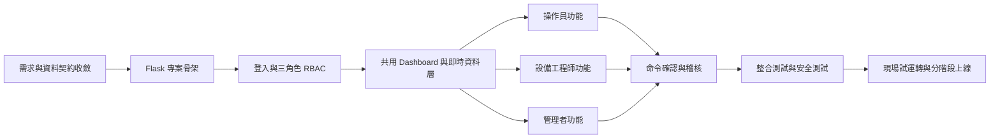
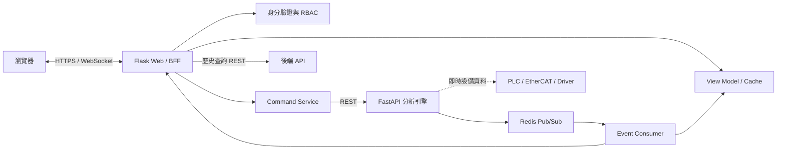
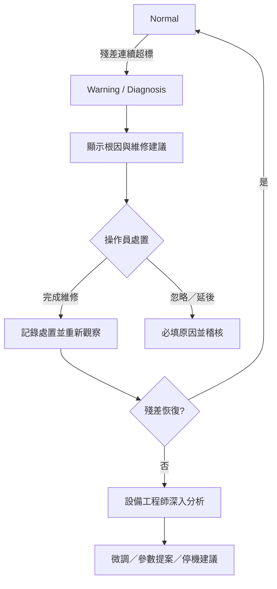

# AI SERVO PLATFORM Flask 前端開發規劃

> 文件狀態：前端規劃草案  
> 規劃依據：`AI SERVO PLATFORM.docx`、`frontend/FRONTEND_API_CONTRACT.md`、`frontend/FOR_FRONTEND_TEAM.md`、`DATA_CONTRACT.md`、`INTEGRATION_GUIDE.md`  
> 技術方向：Python Flask、Jinja2、Bootstrap、Chart.js、Flask-SocketIO、Redis、FastAPI 介面整合  
> 使用者角色：操作員、設備工程師、管理者

---

## 第一部分：流程大綱

### 1. 開發目標

以 Flask 建立 AI SERVO PLATFORM 的 Web HMI／Dashboard，承接文件所定義的 Stage 1 調度、Stage 8 監控及 Stage 9 稽核功能，並依三種角色提供不同的畫面、操作權限與工作流程。

第一版以前端監控、診斷呈現及受控命令為主，不讓瀏覽器直接連線 EtherCAT、PLC 或 Redis，也不讓 AI／Web 畫面成為唯一的安全控制路徑。

### 2. 開發流程總覽



### 3. 建議實作階段

| 階段 | 目的 | 主要交付物 |
|---|---|---|
| Phase 0 | 收斂規格與安全邊界 | 權限矩陣、API 清單、事件格式、狀態機 |
| Phase 1 | 建立 Flask 基礎 | App Factory、Blueprint、設定、錯誤頁、測試框架 |
| Phase 2 | 完成身分驗證與 RBAC | 登入、登出、Session、角色路由保護、操作稽核 |
| Phase 3 | 建立唯讀即時 Dashboard | Redis 消費、WebSocket 推播、狀態卡、趨勢圖、斷線處理 |
| Phase 4 | 完成操作員工作台 | Cycle 操作、警報確認、診斷與維修回報 |
| Phase 5 | 完成設備工程師工作台 | 資料健康、場景、特徵、模型、Shadow、調參審查 |
| Phase 6 | 完成管理者後台 | 使用者、權限、系統設定、稽核、資料保留與整合狀態 |
| Phase 7 | 強化品質與安全 | 單元、契約、E2E、效能、安全、可用性測試 |
| Phase 8 | 試運轉與上線 | Shadow 上線、權限驗收、操作手冊、回復方案 |

### 4. MVP 範圍

第一個可交付版本建議包含：

1. 三角色登入與權限隔離。
2. 即時設備狀態、Scenario、控制模式、異常分數、殘差、延遲及模型版本。
3. 警報列表、警報詳情、診斷根因與維修建議。
4. 操作員執行 Cycle Start／Stop、警報確認及維修結果登錄。
5. 設備工程師檢視資料健康、Fallback、模型與 Shadow 結果。
6. 管理者維護帳號、角色、稽核紀錄與資料保留設定。
7. 所有會改變系統狀態的操作，皆產生命令 ID、操作者、時間、原因及執行結果。

MVP 暫不包含 AI 自動寫入伺服參數、由網頁直接執行功能安全停機，以及未經審查即自動上線新模型。

---

## 第二部分：逐步規劃細節

## 5. 系統邊界與前端架構

### 5.1 Flask 在本系統中的定位

Flask 同時扮演：

- Server-rendered Web UI：使用 Jinja2 產生頁面。
- Backend for Frontend（BFF）：替瀏覽器呼叫分析引擎／後端 API。
- 即時事件閘道：訂閱 Redis，再透過 WebSocket 推送給瀏覽器。
- 身分與權限入口：統一管理登入、Session、CSRF、RBAC 與操作稽核。
- 命令安全閘道：驗證權限、參數、確認流程及重複命令。

### 5.2 建議架構



瀏覽器不得直接取得 Redis、資料庫、PLC 或 EtherCAT 的連線資訊。Flask 也不應取代 PLC／Drive 的硬即時控制、安全互鎖或實體 Emergency Stop。

### 5.3 建議技術元件

| 需求 | 建議元件 |
|---|---|
| Web Framework | Flask App Factory + Blueprints |
| HTML | Jinja2 Templates |
| 樣式與元件 | Bootstrap 5 + 專案自訂 Design Tokens |
| 趨勢圖 | Chart.js |
| 局部互動 | 原生 JavaScript；必要時使用 HTMX，避免過早導入 SPA |
| 即時推播 | Flask-SocketIO；伺服器端訂閱 Redis |
| 登入 | Flask-Login 或組織既有 SSO/OIDC |
| 表單與 CSRF | Flask-WTF |
| 資料驗證 | Pydantic／JSON Schema |
| 資料存取 | Flask 只透過 API；使用者與 Session 可使用 PostgreSQL／Redis |
| Migration | SQLAlchemy + Alembic／Flask-Migrate |
| 測試 | pytest、Flask test client、Playwright |

### 5.4 建議目錄結構

```text
frontend/
├── app/
│   ├── __init__.py
│   ├── config.py
│   ├── extensions.py
│   ├── auth/                 # 登入、Session、RBAC
│   ├── layout/              # 共用主工作檯佈局（Header、側欄、共用模板）
│   ├── operator/             # 操作員 Blueprint（路由 /operator/*）
│   ├── engineer/             # 設備工程師 Blueprint（路由 /engineer/*）
│   ├── admin/                # 管理者 Blueprint（路由 /admin/*）
│   ├── commands/             # 命令驗證、確認、送出、狀態查詢
│   ├── integrations/
│   │   ├── analysis_api.py   # FastAPI client
│   │   ├── backend_api.py    # 歷史／稽核 API client
│   │   ├── redis_events.py   # Redis consumer
│   │   └── normalizers.py    # 外部事件轉成前端 View Model
│   ├── templates/
│   │   ├── layout/           # 主工作檯共用佈局模板（base.html、sidebar.html）
│   │   ├── operator/         # 操作員頁面模板
│   │   ├── engineer/         # 設備工程師頁面模板
│   │   └── admin/            # 管理者頁面模板
│   └── static/
│       ├── css/
│       ├── js/
│       └── icons/
├── tests/
│   ├── unit/
│   ├── contract/
│   ├── integration/
│   └── e2e/
├── migrations/
├── wsgi.py
└── requirements.txt
```

---

## 6. 三角色定義與權限矩陣

### 6.1 權限原則

- 使用最小權限，不把管理者視為可以無條件操作設備的「超級操作員」。
- 讀取權限與控制權限分開。
- 高風險操作必須輸入原因、再次確認，必要時採雙人核准。
- 伺服器端必須重新驗證權限，不能只靠隱藏按鈕。
- 所有新增、修改、刪除、命令、核准與登入事件均寫入稽核日誌。
- 前端呼叫後端 API 時，Flask BFF 必須在請求中附加 `X-Correlation-ID`、`X-User-ID`、`X-User-Role`；後端應驗證這些欄位並寫入稽核。

### 6.2 角色職責

#### 操作員

負責日常運轉、狀態監控、Cycle 操作、警報確認、依診斷建議執行現場檢查，以及回報維修結果。不能修改模型、特徵權重、Scenario 或全域設定。

#### 設備工程師

負責設備與資料健康分析、根因診斷、Scenario 與特徵設定、模型訓練／Shadow 評估、Fallback 分析及參數調整提案。正式環境的高風險變更仍需核准。

#### 管理者

負責帳號與角色、系統設定、整合狀態、資料生命週期、模型治理核准及稽核查詢。管理者預設只有設備控制的唯讀權限，避免帳號管理權與現場操作權集中於同一角色。

### 6.3 功能權限矩陣

符號：`R`＝查看、`E`＝執行、`A`＝核准、`—`＝無權限。

| 功能 | 操作員 | 設備工程師 | 管理者 |
|---|---:|---:|---:|
| 即時 Dashboard、狀態及趨勢 | R | R | R |
| Cycle Start／Stop | E | R | R |
| ON／OFF 命令 | E | R | R |
| 警報確認、填寫處置結果 | E | E | R |
| 查看 SHAP／根因／維修建議 | R | R | R |
| 進入診斷模式 | E | E | R |
| 性能微調申請 | E | E | A |
| 修改特徵權重 | — | E | A |
| 建立／修改 Scenario | — | E | A |
| 觸發 Fine-tune／Full Retrain | — | E | A／R |
| 查看 Shadow 與模型比較 | R | R | R |
| 正式模型 Promotion／Rollback | — | E | A |
| 產生參數調整提案 | — | E | R／A |
| 套用受限參數調整 | 確認現場條件 | E | A（高風險時） |
| 使用者與角色管理 | — | — | E |
| 系統、保留策略與整合設定 | — | — | E |
| 稽核日誌／匯出 | 自己的操作 | R | R／E |

實際權限應以 permission code 表達，例如 `cycle.start`、`alarm.ack`、`model.retrain`、`model.promote`，不要只在程式中判斷角色名稱。

---

## 7. 資訊架構與頁面規劃

### 7.1 共用頁面

| 路由 | 頁面 | 內容 |
|---|---|---|
| `/login` | 登入 | 帳號密碼或 SSO、登入錯誤、鎖定狀態 |
| 登入後依角色導向 | 各角色主畫面 | 操作員→`/operator/console`、工程師→`/engineer/health`、管理者→`/admin/approvals` |
| `/profile` | 個人資訊 | 密碼／MFA／登入紀錄（依認證方式） |
| `/403`、`/404`、`/500` | 錯誤頁 | 顯示追蹤 ID，不洩漏內部錯誤 |

### 7.2 共用主工作檯佈局

所有角色共用同一主工作檯框架（Header + 側欄 + 內容區），由以下區域組成：

```
┌─────────────────────────────────────────────┐
│  Header：Scenario │ 模式 │ 系統狀態 │ 時間 │ 連線 │ 登入者 │ 角色 │
├──────┬──────────────────────────────────────┤
│ 側欄  │                                       │
│ 導航  │           操作頁面內容區               │
│ (依   │                                       │
│ 角色  │                                       │
│ 顯示) │            主畫面 / 功能頁             │
│       │                                       │
├──────┴──────────────────────────────────────┤
│  Footer：版本 │ 連線狀態指示                   │
└─────────────────────────────────────────────┘
```

- **Header**：全站固定，顯示 Scenario、運轉模式、系統狀態、資料更新時間、連線狀態、登入者與角色。
- **側欄**：依角色動態產生導航選單，僅顯示該角色有權限進入的功能頁。
- **內容區**：預設載入該角色的**主畫面**（console / health / approvals），點擊側欄切換至**功能頁**。

路由設計：

| 路由 | 意義 |
|---|---|
| `/operator/console` | 操作員主畫面（登入預設） |
| `/operator/alarms` | 操作員功能頁 |
| `/engineer/health` | 工程師主畫面（登入預設） |
| `/engineer/scenarios` | 工程師功能頁 |
| `/admin/approvals` | 管理者主畫面（登入預設） |
| `/admin/users` | 管理者功能頁 |

### 7.3 操作員主畫面與功能頁

#### 主畫面：`/operator/console` — 主控制台

**設計目標**：值班操作員一眼判斷「設備是否正常、正在做什麼、是否需要處理、下一步該做什麼」，不需點擊任何功能頁就能掌握全貌。

**佈局（由上而下）**：

```
┌──────────────────────────────────────────────────┐
│ ⚪ 系統狀態燈 (Normal/Watch/Warning/Critical)     │ ← 第一優先
│    目前: Running ─ Scenario: S01 ─ Mode: Normal    │    全廠狀態
├──────────────────────────────────────────────────┤
│ ┌──────┐  ┌──────────┐  ┌──────────┐            │
│ │ DV   │  │  Residual │  │  警報    │            │ ← 第二優先
│ │ 0.13 │  │  0.021    │  │  2 active│            │    三大關鍵數字
│ │ 正常 │  │  在閾值內  │  │  1 critical           │
│ └──────┘  └──────────┘  └──────────┘            │
├──────────────────────────────────────────────────┤
│ ┌────────────┐  ┌────────────┐  ┌────────────┐   │
│ │ ▶ Cycle   │  │ ⏹ Stop    │  │ ⚠ E-Stop  │   │ ← 第三優先
│ │   Start   │  │            │  │   Request  │   │    主要控制
│ └────────────┘  └────────────┘  └────────────┘   │
├──────────────────────────────────────────────────┤
│ DV 趨勢 ━━━━━━━━━━━━━━━━━━━━━━━━━━━  │ ← 第四優先
│ Residual ━━━━━━━━━━━━━━━━━━━━━━━━━━━ │    即時趨勢迷你圖
├──────────────────────────────────────────────────┤
│ 最近警報 (top 5)                                  │ ← 第五優先
│ ⚠ 2026-07-22 14:23:11 │ Residual > 3σ │ S01     │    快速入口
│ ⚠ 2026-07-22 14:20:05 │ DV spike      │ S01     │
└──────────────────────────────────────────────────┘
```

**資訊層級**：
| 層級 | 內容 | 更新頻率 | 目的 |
|---|---|---|---|
| L1 系統狀態 | 狀態燈、模式、Scenario、運轉中/停止 | 事件驅動 | 秒級判斷是否正常 |
| L2 三大關鍵數字 | DV、Residual、Active Alarms | 1s | 量化健康程度 |
| L3 主要控制 | Cycle Start/Stop、E-Stop Request | 點擊 | 日常操作 |
| L4 即時趨勢 | DV 折線、Residual 折線（Ring Buffer 5min） | 1s | 趨勢判斷 |
| L5 事件摘要 | 最近 5 筆警報 + 快連結 | 事件驅動 | 快速跳轉處置 |

**全畫面零模型細節**，模型數據只有在點擊警報或進入診斷功能頁才出現。

#### 功能頁一覽

| 路由 | 頁面 | 核心元件 | 類型 |
|---|---|---|---|
| `/operator/alarms` | 警報中心 | active/acknowledged/resolved 篩選、嚴重度、時間、設備 | 功能頁 |
| `/operator/alarms/<id>` | 警報詳情 | 異常分數、殘差、根因、維修建議、確認與備註 | 功能頁 |
| `/operator/diagnosis` | 診斷中心 | SHAP 進度、根因排名、機械檢查清單 | 功能頁 |
| `/operator/cycles` | Cycle 紀錄 | 起訖時間、Scenario、結果、異常數、終止原因 | 功能頁 |
| `/operator/maintenance` | 維修回報 | 已執行項目、結果、照片／附件參考、殘差恢復狀態 | 功能頁 |

### 7.4 設備工程師主畫面與功能頁

#### 主畫面：`/engineer/health` — 設備／資料健康總覽

**設計目標**：工程師一進畫面就知道「系統哪些環節正常、哪裡需要關注」，快速定位問題是出在通訊層、資料品質、模型還是 Fallback。

**佈局（由上而下）**：

```
┌──────────────────────────────────────────────────┐
│ 系統健康分數：90% ─ 需關注項目：3                  │ ← 第一優先
│ ┌──────┐ ┌──────┐ ┌──────┐ ┌──────┐ ┌──────┐     │    總覽指標
│ │通訊   │ │資料   │ │模型   │ │Fallbk │ │延遲   │
│ │🟢正常 │ │🟢正常 │ │🟡注意 │ │🟢正常 │ │🟢正常 │
│ │99.9%  │ │0.1%NaN│ │R2 0.94│ │0 fail │ │0.31ms│
│ └──────┘ └──────┘ └──────┘ └──────┘ └──────┘     │
├──────────────────────────────────────────────────┤
│ ⚠ 需關注項目                                        │ ← 第二優先
│ ┌─────────────────────────────────────────────┐   │    異常摘要
│ │ ⚡ Model Drift Detected │ Scenario S01     │   │
│ │   FE_RMS 特徵偏移 12% │ 建議檢視 Shadow    │   │
│ └─────────────────────────────────────────────┘   │
│ ┌─────────────────────────────────────────────┐   │
│ │ ⚡ 訓練任務 #42 已完成 │ RMSE 0.018        │   │
│ │   新模型 v3.2.1 待 Promotion               │   │
│ └─────────────────────────────────────────────┘   │
├──────────────────────────────────────────────────┤
│ 主要指標趨勢                                        │ ← 第三優先
│ 資料品質分數 ━━━━━━━━━━━━━━━━━━━━━━ 99.5% │    趨勢圖
│ Packet Loss  ━━━━━━━━━━━━━━━━━━━━━━━━ 0.01% │
│ Cycle Time   ━━━━━━━━━━━━━━━━━━━━━━━━ 0.8ms │
│ Model R²     ━━━━━━━━━━━━━━━━━━━━━━━━ 0.94 │
├──────────────────────────────────────────────────┤
│ 最近事件時間線                                      │ ← 第四優先
│ 14:20 │ Model Shadow Passed │ v3.2.0 → v3.2.1   │    快連結
│ 13:45 │ Fallback 觸發 │ Chain: RF→PID→OK        │
│ 13:00 │ 特徵權重更新 │ Scenario S01             │
└──────────────────────────────────────────────────┘
```

**資訊層級**：
| 層級 | 內容 | 更新頻率 | 目的 |
|---|---|---|---|
| L1 系統健康卡片 | 5 張卡片：通訊、資料、模型、Fallback、延遲 | 1s | 秒級掃描各子系統狀態 |
| L2 需關注項目 | 異常摘要列表，含嚴重度與快連結 | 事件驅動 | 不遺漏任何問題 |
| L3 主要趨勢 | 4 條關鍵指標折線（Ring Buffer 1h） | 1s | 長期趨勢判斷 |
| L4 事件時間線 | 最近 10 筆系統事件 | 事件驅動 | 快速回溯上下文 |

**卡片行為**：點擊任何健康卡片直接跳到對應功能頁（點「模型」卡 → `/engineer/models`，點「Fallback」卡 → `/engineer/fallbacks」）。

#### 功能頁一覽

| 路由 | 頁面 | 核心元件 | 類型 |
|---|---|---|---|
| `/engineer/features` | 特徵監控 | 特徵值、baseline、z-score、權重與版本 | 功能頁 |
| `/engineer/scenarios` | Scenario 模型庫 | active/pending/archived、相似度、模型版本 | 功能頁 |
| `/engineer/scenarios/new` | 新工況建立 | 名稱、適用設備、特徵、門檻、資料範圍、審核送出 | 功能頁 |
| `/engineer/models` | 模型登錄 | L1/L2/L3、版本、狀態、指標、最後訓練時間 | 功能頁 |
| `/engineer/models/<version>` | 模型詳情 | 資料版本、參數、指標、延遲、變更紀錄 | 功能頁 |
| `/engineer/shadow` | Shadow 比較 | 新舊模型指標、期間、樣本覆蓋、通過／拒絕原因 | 功能頁 |
| `/engineer/fallbacks` | Fallback 分析 | 連續失敗數、目前鏈節點、PID 狀態、事件時間線 | 功能頁 |
| `/engineer/adjustments` | 調整提案 | Drive/PLC 參數、原值、建議值、邊界、理由、審核狀態 | 功能頁 |
| `/engineer/jobs` | 訓練任務 | queue/running/succeeded/failed、進度、取消、錯誤摘要 | 功能頁 |

### 7.5 管理者主畫面與功能頁

#### 主畫面：`/admin/approvals` — 待核准事項

**設計目標**：管理者一進畫面知道「有多少待辦、系統是否健康、最近發生什麼大事」，不需四處點功能頁。

**佈局（由上而下）**：

```
┌──────────────────────────────────────────────────┐
│ ⚠ 待處理事項：4                                   │ ← 第一優先
│ ┌──────────┐ ┌──────────┐ ┌──────────┐ ┌──────┐ │    待辦計數卡
│ │ 模型上線  │ │ Scenario │ │  調參    │ │ 異常  │
│ │  2 件待核准 │  1 件待核准 │  1 件待核准 │ 0    │ │
│ └──────────┘ └──────────┘ └──────────┘ └──────┘ │
├──────────────────────────────────────────────────┤
│ 待核准列表 (依時間排序，最舊在上)                    │ ← 第二優先
│ ┌─────────────────────────────────────────┐       │    主要操作區
│ │ 📋 模型 Promotion：v3.2.0 → v3.2.1     │       │
│ │    提出：張工 2026-07-22 14:00          │       │
│ │    RMSE 改善 5.2% │ Shadow 通過        │       │
│ │    [核准] [拒絕] [檢視詳情]             │       │
│ ├─────────────────────────────────────────┤       │
│ │ 📋 新 Scenario：S04_高轉速輕載          │       │
│ │    提出：王工 2026-07-22 10:30          │       │
│ │    相似度：與 S01 87% │ 建議審查特徵    │       │
│ │    [核准] [退回] [檢視詳情]             │       │
│ └─────────────────────────────────────────┘       │
├──────────────────────────────────────────────────┤
│ 系統整合狀態                                        │ ← 第三優先
│ FastAPI 🟢 12ms │ Redis 🟢 3ms │ DB 🟢 5ms      │    快速健康檢查
│ 時間同步 🟢 NTP │ 版本一致 ✅                    │
├──────────────────────────────────────────────────┤
│ 最近稽核事件                                        │ ← 第四優先
│ 14:05 │ admin │ 核准模型上線 v3.2.1             │    監控異常行為
│ 13:20 │ 李四  │ 登入失敗 ×3 │ IP 192.168.1.50 │
│ 12:00 │ system │ 資料保留清理完成 │ 回收 2.3GB   │
└──────────────────────────────────────────────────┘
```

**資訊層級**：
| 層級 | 內容 | 更新頻率 | 目的 |
|---|---|---|---|
| L1 待辦計數卡 | 4 張卡片：模型/Scenario/調參/異常 | 事件驅動 | 秒級掌握待辦量 |
| L2 待核准列表 | 完整待核准項目，含提名人、時間、摘要 | 事件驅動 | 主要操作區 |
| L3 系統整合狀態 | 各服務連線狀態與延遲 | 1s | 確認系統健康 |
| L4 最近稽核 | 最近稽核事件，含登入失敗警示 | 事件驅動 | 安全監控 |

#### 功能頁一覽

| 路由 | 頁面 | 核心元件 | 類型 |
|---|---|---|---|
| `/admin/users` | 使用者管理 | 建立、停用、解鎖、角色指派、最後登入 | 功能頁 |
| `/admin/roles` | 權限檢視 | 角色與 permission code 對照，避免任意自訂高風險角色 | 功能頁 |
| `/admin/audit` | 稽核中心 | 操作者、事件、時間、結果、追蹤 ID、匯出 | 功能頁 |
| `/admin/retention` | 資料保留 | 7／30／90 天策略、預估容量、清理任務狀態 | 功能頁 |
| `/admin/integrations` | 整合狀態 | FastAPI、Redis、DB、時間同步、版本與健康檢查 | 功能頁 |
| `/admin/settings` | 系統設定 | UI 更新頻率、告警門檻顯示、通知、維護模式 | 功能頁 |

合規頁面應顯示「稽核鏈完整性／證據狀態」，不能僅依單一布林欄位顯示「IEC 61508 已認證」。

---

## 8. 核心使用流程

### 8.1 登入與角色導向

1. 使用者登入。
2. Flask 驗證帳號、狀態、角色及可用 permission。
3. 建立 server-side session，寫入登入稽核事件。
4. 依角色導向對應主畫面：操作員→`/operator/console`、設備工程師→`/engineer/health`、管理者→`/admin/approvals`。
5. 每一個受保護路由及 POST 命令再次檢查 permission。

### 8.2 操作員正常運轉

1. 進入主控制台並取得 dashboard snapshot。
2. WebSocket 開始接收 `inference`、`dashboard`、`diagnosis`、`mode_change` 事件。
3. 操作員選擇 Scenario，按下 Cycle Start。
4. 畫面顯示命令摘要與影響，要求再次確認。
5. Flask 產生 `command_id` 與 idempotency key，送出命令。
6. UI 顯示 pending，等待 accepted／completed／failed 回覆，不可只因 HTTP 200 就顯示成功。
7. Cycle 期間即時顯示狀態、殘差與警報。

### 8.3 異常、診斷與維修



任何「忽略警報」只代表已讀或延後處置，不應清除實際設備異常狀態。

### 8.4 模型重訓與上線

1. 設備工程師查看觸發原因、資料期間、資料健康與目前模型。
2. 送出 Fine-tune／Full Retrain 任務並填寫理由。
3. 前端顯示 queued、running、evaluating、shadow、passed/failed 狀態。
4. Shadow 頁比較新舊模型的 RMSE、誤報／漏報、延遲、樣本數與工況覆蓋。
5. 工程師提出 promotion 或 rollback 建議。
6. 正式環境由管理者核准；後端完成原子切換。
7. UI 只在收到 model switched 事件後更新 active version。

### 8.5 新 Scenario 建立

1. 系統產生 `new_scenario_request`，顯示與既有 Scenario 的相似度。
2. 設備工程師確認名稱、設備、資料期間、特徵、健康 baseline 與門檻。
3. 執行資料品質檢查與離線驗證。
4. 送管理者核准。
5. 通過後進入 Shadow，不直接成為 active Scenario。
6. Shadow 驗證通過後再由核准流程啟用。

### 8.6 Emergency Stop 畫面行為

網頁上的按鈕應定義為「發送 Emergency Stop Request」：

1. 按鈕需防誤觸，但不得設計成繁瑣到延誤處置。
2. 點擊後立即送出高優先命令，畫面持續顯示 pending，直到收到設備端確認。
3. 若逾時，清楚提示「未確認停機」，不可顯示已停止。
4. 寫入操作者、設備、時間、原因、命令 ID 與確認結果。
5. 真正功能安全停機仍由實體按鈕、安全 PLC／Drive 及硬體迴路負責。

---

## 9. 即時資料與 API 整合

### 9.1 資料來源

| 類型 | 來源 | Flask 用途 | 瀏覽器更新策略 |
|---|---|---|---|
| `ai_servo:inference` | Redis | 異常分數、severity、latency | 伺服器節流後 5–10 FPS |
| `ai_servo:dashboard` | Redis | 全 Stage 合併狀態 | 每秒或事件更新 |
| `ai_servo:diagnosis` | Redis | 根因及維修建議 | 事件驅動 |
| `ai_servo:dispatcher` | Redis | 殘差、調度、模式切換 | 事件驅動 |
| Shadow／模型事件 | Redis 或 REST | 模型比較與版本切換 | 事件驅動 |
| 歷史趨勢／稽核 | 後端 REST API | 圖表、表格、匯出 | 依查詢載入 |
| 控制命令 | FastAPI REST | Cycle、模式、訓練、調整 | POST＋命令狀態追蹤 |

即使來源可達 50 kHz，前端也只應接收彙總或節流後資料，不能逐筆更新 DOM 或逐筆繪圖。

### 9.2 Flask BFF 端點草案

| Method | Flask 端點 | Permission | 用途 |
|---|---|---|---|
| GET | `/api/ui/dashboard/snapshot` | `dashboard.read` | 初始完整狀態 |
| GET | `/api/ui/trends` | `trend.read` | 1h／8h／24h 趨勢 |
| GET | `/api/ui/alarms` | `alarm.read` | 警報查詢 |
| POST | `/api/ui/alarms/<id>/ack` | `alarm.ack` | 確認警報 |
| POST | `/api/ui/commands/cycle/start` | `cycle.start` | 開始 Cycle |
| POST | `/api/ui/commands/cycle/stop` | `cycle.stop` | 停止 Cycle |
| POST | `/api/ui/commands/mode` | `mode.switch` | 模式切換 |
| POST | `/api/ui/commands/retrain` | `model.retrain` | 觸發訓練 |
| POST | `/api/ui/models/<version>/promote` | `model.promote` | 提出／執行上線 |
| POST | `/api/ui/emergency-stop-request` | `safety.stop_request` | 發送停機請求 |

Flask 端點負責將外部 API 的格式轉換成穩定的 UI View Model，模板與 JavaScript 不直接依賴所有 Stage 的原始 JSON。

> **依賴確認**：以上 Flask BFF 端點需要對應的後端 API 支援。截至 `AI SERVO PLATFORM.docx` 與 `前端資料規格書.docx`，後端僅定義了唯讀 GET 端點（/l1/realtime、/l1/latency、/l2/latest、/l2/trend、/l3/latest、/l3/shadow、/l3/models、/shap/diagnosis、/shap/summary、/fallback/events、/fallback/stats）以及 WebSocket 訂閱主題（ws/l1/inference、ws/l1/summary、ws/l2/finetune、ws/l3/deploy、ws/shap/diagnosis、ws/fallback/event、ws/fallback/escalation）。  
> **尚未定義的後端 API：** POST 命令（cycle start/stop、mode switch）、警報確認（alarm ack）、Emergency Stop Request、使用者管理、角色管理。這些需在 Phase 0 與後端團隊補齊。

### 9.3 WebSocket 事件草案

| 事件 | payload 重點 | 對應後端 Topic |
|---|---|---|
| `dashboard:update` | scenario、mode、system_status、連線狀態 | ws/l1/summary |
| `inference:update` | DV_mean、ylabel、confidence、latency | ws/l1/inference |
| `alarm:new` | alarm_id、severity、device、timestamp、root_cause、建議 | ws/fallback/event |
| `alarm:updated` | alarm_id、status（acknowledged/resolved）、operator、note | — |
| `diagnosis:progress` | progress_pct、current_stage | ws/shap/diagnosis |
| `diagnosis:completed` | root_cause_ranking、shap_force_plot、maintenance_suggest | ws/shap/diagnosis |
| `mode:changed` | from_mode、to_mode、operator、reason | 無專屬 topic，建議新增 |
| `training:progress` | job_id、status（queued/running/evaluating）、progress_pct、RMSE | ws/l2/finetune、ws/l3/deploy |
| `shadow:completed` | old_version、new_version、rmse_old、rmse_new、improvement_pct、passed | ws/l3/deploy |
| `model:changed` | model_version、scenario、status（active/rollback）、hash | ws/l3/deploy |
| `command:status` | command_id、status（submitted/accepted/completed/failed/timeout）、reason | — |
| `system:connection` | service（redis/fastapi/db）、status（connected/disconnected）、latency | — |

每個事件至少包含 `event_id`、`event_type`、`timestamp`、`scenario_id`、`schema_version` 及 payload。

> **缺口**：後端目前僅定義 ws/l1/*、ws/l2/*、ws/l3/*、ws/shap/*、ws/fallback/*。缺少獨立的 `mode:changed` 與 `command:status` 事件 topic，需與後端協調新增或由 Flask BFF 自行產生。

### 9.4 斷線與資料過期

- 每個狀態卡顯示最後更新時間。
- 超過預期更新時間即標示 stale，不沿用綠色正常狀態。
- WebSocket 斷線採指數退避重連，重連後先取得 snapshot，再接續事件。
- 以 `event_id` 去重，避免重連後重複顯示警報。
- 命令逾時維持 unknown／unconfirmed，不自行推定成功或失敗。
- 後端 UTC 時間由 Flask 轉為使用者時區顯示，同時保留原始時間供稽核。

---

## 10. UI／UX 設計準則

### 10.1 狀態語意

| 狀態 | 顏色 | 額外表達 |
|---|---|---|
| Normal | 綠 | 圖示＋文字「正常」 |
| Watch | 黃 | 圖示＋文字「注意」 |
| Warning／Alarm | 橙 | 圖示＋處置入口 |
| Critical／Error | 紅 | 圖示＋明確行動及時間 |
| Unknown／Stale | 灰 | 顯示「資料中斷／未確認」 |

不能只依靠顏色表達狀態，需同時提供文字、圖示及時間。

### 10.2 高風險操作元件

- 危險按鈕與一般導覽分離。
- 確認對話框顯示設備、Scenario、目前狀態、目標狀態及影響。
- 修改參數時同時顯示原值、建議值、允許範圍與差異百分比。
- 需要核准的操作顯示提出者、核准者及狀態，禁止同一人完成雙人核准。
- 防止重複點擊，命令送出後按鈕進入 pending。

### 10.3 圖表與資料表

- 即時圖表使用固定大小 ring buffer，避免瀏覽器記憶體持續增長。
- 1h／8h／24h 使用後端彙總，不從瀏覽器自行累積。
- 圖表標示 threshold、異常區段、模式切換與模型版本切換點。
- 大型表格使用伺服器端分頁、篩選與排序。

---

## 11. 安全、稽核與可靠性

### 11.1 Web 安全基線

- 全站 HTTPS，Cookie 使用 Secure、HttpOnly、SameSite。
- 所有狀態變更端點啟用 CSRF 防護。
- 密碼採可靠雜湊；正式環境優先串接 SSO/OIDC 與 MFA。
- 登入失敗限制、帳號鎖定、Session timeout 及主動登出。
- Content Security Policy、輸入驗證、輸出編碼及檔案上傳限制。
- Redis、資料庫及 FastAPI 憑證只存在伺服器端 secret store。
- 每個請求及命令帶 correlation ID，方便跨 Flask、分析引擎與後端追蹤。

### 11.2 稽核欄位

所有 mutation 至少記錄：

- `event_id`、`correlation_id`、`command_id`
- 使用者 ID、角色、來源 IP／終端識別
- 動作類型、目標設備、Scenario
- 原值、新值、原因
- 提出時間、核准時間、執行時間
- accepted／completed／failed／timeout 結果
- 相關模型版本與模式

### 11.3 安全控制原則

- UI 顯示「命令已送出」與「設備已執行」為不同狀態。
- AI 模型失敗、Web 斷線或 Redis 斷線時，設備控制不得依賴 Flask 維持安全。
- 參數值必須由後端再次檢查白名單、型別、上下限、變化率與設備狀態。
- 模型 Promotion、Scenario 啟用及高風險調整使用不可否認的核准紀錄。

---

## 12. 測試與驗收流程

### 12.1 測試層級

| 測試 | 內容 |
|---|---|
| 單元測試 | permission、schema normalizer、狀態映射、表單與命令驗證 |
| 路由測試 | 未登入、無權限、合法操作、CSRF、錯誤回應 |
| 契約測試 | Redis event／FastAPI response 與前端 schema 相容性 |
| 整合測試 | Redis → Flask → WebSocket → Browser；Flask → FastAPI → command status |
| E2E 測試 | 三角色完整工作流程及越權嘗試 |
| 效能測試 | 多連線 WebSocket、50Hz 聚合輸入、歷史查詢與圖表載入 |
| 韌性測試 | Redis、FastAPI、DB 中斷、重連、重複事件、事件亂序 |
| 安全測試 | XSS、CSRF、Session、暴力登入、IDOR、權限提升 |
| 可用性測試 | 值班環境、警報辨識、鍵盤操作、色弱可辨識性 |

### 12.2 角色驗收案例

#### 操作員

- 可以在單一畫面辨識設備、模式、Scenario、警報及連線狀態。
- 可以啟停 Cycle、確認警報、查看診斷並回報維修結果。
- 無法進入模型、Scenario、使用者與全域設定修改頁。
- 命令逾時時不會被誤導為執行成功。

#### 設備工程師

- 可以定位 EtherCAT／資料品質／模型／Fallback 問題。
- 可以建立 Scenario 草稿、調整特徵、觸發訓練及提出模型上線。
- 無法自行繞過正式環境的核准程序。
- 所有參數調整都能看到原值、界限、理由及執行結果。

#### 管理者

- 可以管理使用者與權限、查詢稽核、處理核准及檢查整合狀態。
- 管理者帳號不會因為能管理使用者，就自動取得現場設備操作權。
- 可以追蹤模型、Scenario、設定及操作命令的完整變更鏈。

### 12.3 建議非功能驗收條件

- Flask 收到 critical event 後，前端在正常網路下 1 秒內顯示。
- Dashboard 初始 snapshot 在正常環境下 2 秒內可見。
- 即時頁面長時間運行不持續增加記憶體。
- 100% 狀態變更操作具有操作者、原因及結果稽核紀錄。
- 所有受保護端點均有未登入與越權測試。
- 斷線、資料過期及命令未確認均有明確 UI 狀態。

---

## 13. 分階段上線策略

### Stage A：Mock 與唯讀模式

使用固定 JSON 與 Redis mock event 完成畫面，不送任何設備命令。先驗證角色導航、狀態語意與資訊密度。

### Stage B：測試環境即時整合

接入測試 Redis、FastAPI 與歷史 API。開放 Cycle 與模式命令，但目標為模擬器或測試機。

### Stage C：正式環境 Shadow

正式資料只讀，所有命令仍由現有操作方式執行。比對前端顯示與現場 HMI／後端紀錄是否一致。

### Stage D：受限操作

先開放警報確認、維修回報，再開放 Cycle 命令；訓練、模型上線與參數調整維持核准流程。

### Stage E：正式驗收

完成角色 UAT、故障演練、回復方案、帳號盤點、稽核驗證、部署文件與操作手冊後正式上線。

---

## 14. 開發前必須確認的決策

1. 使用者身分來源：本機帳號、公司 AD、OIDC 或其他 SSO。
2. 操作員是否可執行 ON／OFF，以及設備端實際允許的狀態條件。
3. Web Emergency Stop 的正式名稱、回覆格式與硬體安全邊界。
4. `POST /api/v1/command` 的 request、accepted、completed、failed schema。
5. 命令狀態查詢或回推機制，以及 idempotency 規則。
6. Stage 編號的唯一版本，特別是 Stage 2 通訊層／模型庫的差異。前端設計參考的 Stage 1/8/9 需與 `AI SERVO PLATFORM.docx` 的 Stage 1~9 定義對齊。
7. L1 模型及指標的唯一規格：Isolation Forest、RF／XGBoost 或其他模型。
8. 目前實際 Scenario 數量與 40 Scenarios 的交付順序。
9. 模型上線、Scenario 啟用及參數調整是否採雙人核准。
10. 歷史查詢、使用者管理及稽核匯出的正式後端 API。  
11. **操作命令 API 規格**：後端 FastAPI 需提供 table-align: centerPOST /command/cycle/start、/command/cycle/stop、/command/mode 等端點，含 command_id、idempotency_key、狀態機（submitted→accepted→completed/failed/timeout）。  
12. **警報事件 topic 規格**：後端 Redis／WebSocket 需提供 alarm:new、alarm:updated 事件的完整 payload schema。  
13. **mode:changed 事件來源**：目前後端無專屬 topic，需確認由 Flask 自行推斷或後端新增。  
14. **使用者管理 API**：後端需提供 CRUD 使用者、角色指派、查詢稽核的 REST API。

在以上決策尚未全部完成前，可先以 adapter、mock schema 及 feature flag 開發，避免 UI 被單一未定案的後端格式綁死。

---

## 15. Definition of Done

每個前端功能只有在以下條件全部完成後才視為完成：

1. 已定義使用角色與 permission code。
2. 已有正常、空資料、loading、stale、error、forbidden 狀態。
3. 已完成輸入驗證、CSRF、伺服器端權限檢查及稽核。
4. 已有 API／事件 schema 與 mock fixture。
5. 已完成單元、路由、契約及主要 E2E 測試。
6. 已驗證不同角色看不到且無法呼叫未授權功能。
7. 已驗證斷線、逾時、重複事件及命令失敗。
8. 已完成操作說明、錯誤訊息及驗收紀錄。

此流程可先交付安全的監控與診斷平台，再逐步開放受控操作，避免前端開發進度與尚未收斂的 AI 控制策略互相綁死。
